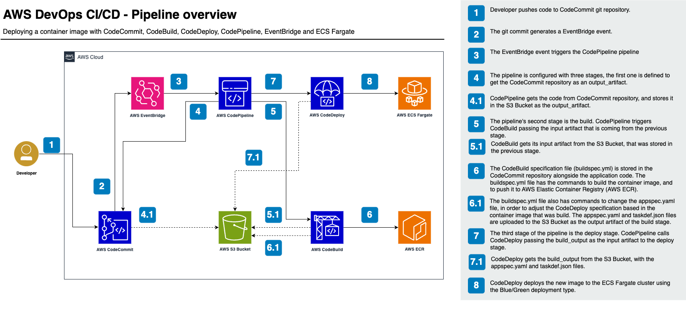

# AWS DevOps Pipeline
## Deploying a Hugo container image with CodeCommit, CodeBuild, CodeDeploy, CodePipeline, EventBridge and ECS Fargate

### TL,DR;
This project is part of my study to get the AWS DevOps Professional Certification. Here, I used some AWS DevOps services (CodeCommit, CodeBuild, CodeDeploy,
and CodePipeline) to create a CI/CD pipeline to build a container image and deploy it to an ECS Fargate cluster.
All the AWS resources are being created by Terraform.

### Project decisions
- To maintain simplicity, the Terraform state file is being stored locally.
- The S3 Bucket to store the pipeline artifacts is being created by the same Terraform, but it can lead to waste of resources in larger environments.
- Although the CodeDeploy configuration is ready to do a Blue/Green deployment type, we will only deploy to one Target Group.
- Terraform is using the AWS credentials configured in the previously installed AWS CLI.
- The application code will be pushed to the created CodeCommit repository after Terraform deploying the infrastructure

### Requirements
- AWS account
- AWS CLI configured with a user having administrative permissions in the AWS account
- Git
- Terraform version 1.4 or higher

### Terraform code will create:

1. A VPC with three subnets, one Internet Gateway and one Application LoadBalancer with two Target Groups.
2. CodeCommit Repository to store the application code .
3. EventBridge Rule to trigger CodePipeline.
4. CodePipeline containing the CodeCommit, CodeBuild and CodeDeploy integration.
5. CodeBuild to build the application container image.
6. CodeDeploy to deploy the application image to a ECS Cluster.
7. ECS Cluster in Fargate mode to run the application.
8. IAM Roles to give permissions between the resources.

### Pipeline overview

1. Developer pushes code to CodeCommit git repository.
2. The git commit generates a EventBridge event.
3. The EventBridge event triggers the CodePipeline pipeline
4. The pipeline is configured with three stages, the first one is defined to get the CodeCommit repository as an output_artifact. 
   1. CodePipeline gets the code from CodeCommit repository, and stores it in the S3 Bucket as the output_artifact.
5. The pipeline's second stage is the build. CodePipeline triggers CodeBuild passing the input artifact that is coming from the previous stage.
   1. CodeBuild gets its input artifact from the S3 Bucket, that was stored in the previous stage.
6. The CodeBuild specification file (buildspec.yml) is stored in the CodeCommit repository alongside the application code. The buildspec.yml file has the commands to build the container image, and to push it to AWS Elastic Container Registry (AWS ECR).
   1. The buildspec.yml file also has commands to change the appspec.yaml file, in order to adjust the CodeDeploy specification based in the container image that was build. The appspec.yaml and taskdef.json files are uploaded to the S3 Bucket as the output artifact of the build stage.
7. The third stage of the pipeline is the deploy stage. CodePipeline calls CodeDeploy passing the build_output as the input artifact to the deploy stage.
   1. CodeDeploy gets the build_output from the S3 Bucket, with the appspec.yaml and taskdef.json files.
8. CodeDeploy deploys the new image to the ECS Fargate cluster using the Blue/Green deployment type.